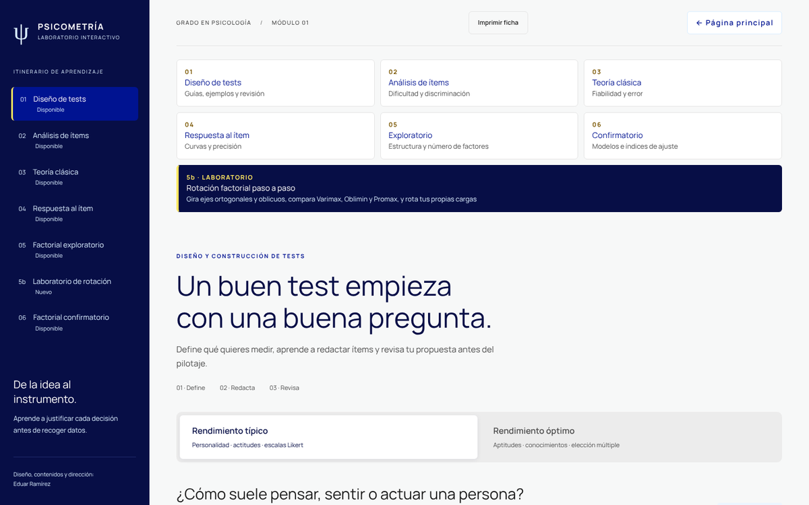
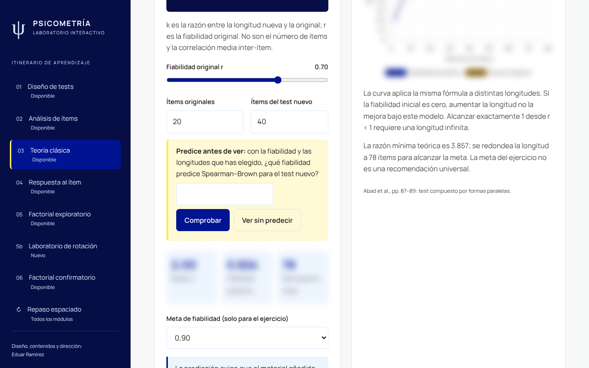
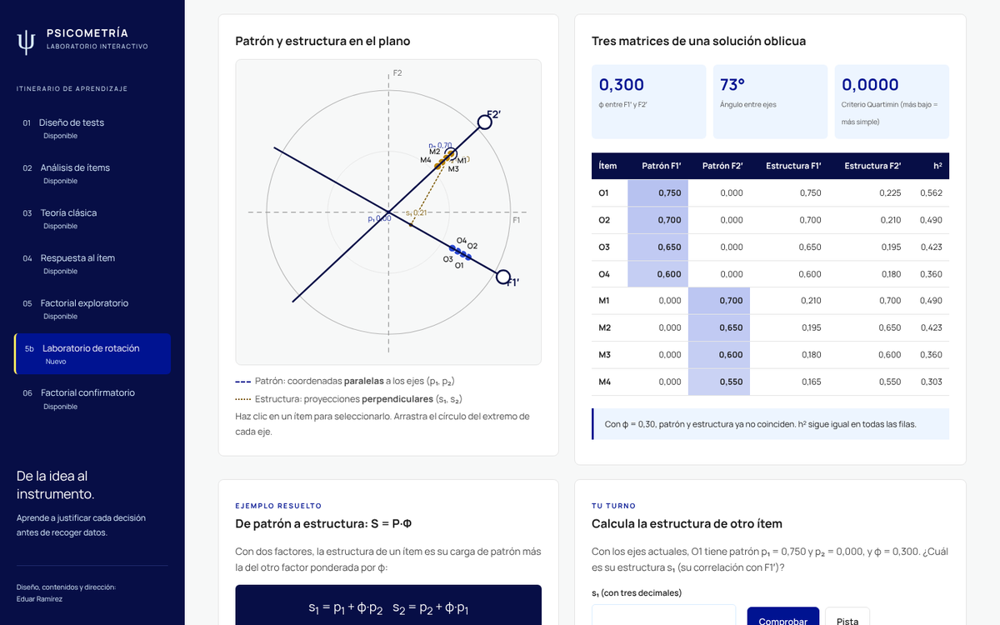

# Laboratorio de psicometría

**Herramientas interactivas en español para enseñar los conceptos básicos de la psicometría:** diseño de tests,
análisis de ítems, teoría clásica, teoría de respuesta al ítem, análisis factorial exploratorio (con un
laboratorio de rotación) y confirmatorio.

Funciona en el navegador sin instalar nada y se puede publicar en GitHub Pages. Incluye apps Shiny para analizar
datos propios en R. Los resultados están contrastados con R (psych, lavaan, GPArotation y mirt).



## Módulos

| | Módulo | Qué hace el estudiante |
|---|---|---|
| 01 | **Diseño de tests** (`index.html`) | Sigue una guía paso a paso, corrige ítems mal redactados y prepara una ficha de ítem con lista de revisión (exportable e importable en JSON) |
| 02 | **Análisis de ítems** (`analisis.html`) | Calcula dificultad, corrección por azar, varianza, correlación ítem-total e ítem-resto, D de grupos extremos, biserial puntual, distractores y α |
| 03 | **Teoría clásica** (`tct.html`) | Trabaja X = T + E, fiabilidad, EEM e intervalos, Spearman–Brown, dos mitades, KR-20/21, α y estimación de Kelley |
| 04 | **Respuesta al ítem** (`tri.html`) | Explora curvas 1PL–4PL y de respuesta graduada, información, error condicional y fiabilidad condicional |
| 05 | **Factorial exploratorio** (`afe.html`) | Revisa KMO y Bartlett, análisis paralelo, extracción, comunalidades y casos Heywood, y compara rotaciones reales de R |
| 5b | **Laboratorio de rotación** (`rotacion.html`) | Gira a mano ejes ortogonales y oblicuos, distingue patrón, estructura y Φ, compara cinco criterios y rota sus propias cargas |
| 06 | **Factorial confirmatorio** (`afc.html`) | Especifica modelos, entiende la identificación y los gl, y lee χ², RMSEA, CFI, TLI, SRMR, Δχ² y AIC/BIC con prudencia |
| ↻ | **Repaso espaciado** (`repaso.html`) | Vuelve días después a las preguntas que falló y a otras de aplicación y transferencia de cualquier módulo |

Cada módulo incluye explicaciones, simuladores, ejercicios con retroalimentación y referencias. Los puntos de
corte se presentan como orientaciones, no como reglas automáticas.

### Diseño didáctico

Todos los módulos siguen la misma secuencia, pensada para que el estudiante produzca algo antes de ver la
solución:

1. **Objetivos observables**, duración y modo de trabajo al empezar.
2. **Predicciones** con grado de seguridad, sin nota. Se contrastan al cerrar el módulo.
3. **Predice antes de ver.** Los resultados clave de cada simulador (Spearman–Brown, máximo de información, número
   de factores, gl) quedan ocultos hasta que el estudiante predice.
4. **Apartados cortos** con botones de avance e indicaciones para trabajar en parejas.
5. **Cuestionario.** Primero se indica el grado de seguridad. Cada opción tiene su explicación, y tras un error
   no se revela la respuesta: pista → solución explicada. Al final se muestra la calibración y se pueden repetir
   las falladas.
6. **Cierre.** Autoexplicación con respuesta modelo, cinco ideas clave y una guía plegable para el docente.
7. **Repaso espaciado** una semana después.



Nada se envía a ningún servidor. Si el docente quiere recoger resultados, cada estudiante descarga un CSV con
un código, sin su nombre. La revisión con los criterios aplicados y las fichas pedagógicas de cada módulo está
en [`docs/REVISION-DIDACTICA.md`](docs/REVISION-DIDACTICA.md). Las herramientas están diseñadas para movilizar
estos procesos, pero su efecto en el aprendizaje no se ha evaluado.

### Laboratorio de rotación



Son siete apartados, de 25 a 35 minutos en total:

1. Predecir qué pasará al rotar.
2. Girar ejes ortogonales hasta la estructura simple y compararse con Varimax.
3. Mover ejes oblicuos, ver las proyecciones paralelas (patrón) y perpendiculares (estructura) y calcular
   S = P·Φ.
4. Comparar Varimax, Quartimax, Oblimin, Promax y Geomin.
5. Ver la solución del Módulo 5 en 3D.
6. Rotar cargas propias, con exportación a CSV y código R equivalente.
7. Cuestionario con grado de seguridad y calibración.

El motor reproduce exactamente `stats::varimax`, GPArotation y `psych::fa`. La explicación completa está en
[`docs/ROTACION.md`](docs/ROTACION.md).

## Uso en clase

**Sin instalar nada.** Descarga el repositorio y abre `index.html` con cualquier navegador actual. Funciona sin
conexión.

**En GitHub Pages:**

1. Sube la carpeta a un repositorio nuevo, por ejemplo `laboratorio-psicometria`.
2. En *Settings → Pages → Build and deployment*, elige **GitHub Actions**.
3. El flujo `.github/workflows/pages.yml` publica la web en cada cambio en `main`. La dirección será
   `https://<usuario>.github.io/laboratorio-psicometria/`.

Cada módulo tiene su propio enlace, que se puede compartir en el aula virtual. Por ejemplo,
`…/rotacion.html#oblicua` abre directamente el apartado de rotación oblicua.

Las sugerencias de uso por módulo, los tiempos y los errores frecuentes están en
[`docs/GUIA-DOCENTE.md`](docs/GUIA-DOCENTE.md).

## Versión en R (Shiny)

Necesitas R 4.1 o posterior y estos paquetes:

```r
install.packages(c("shiny", "psych", "GPArotation", "lavaan", "jsonlite"))
```

Desde la carpeta del repositorio:

```r
shiny::runApp("r")            # toda la web servida desde R
shiny::runApp("r/factor")     # AFE y AFC con CSV propios, incluida la comparación de rotaciones
shiny::runApp("r/rotacion")   # laboratorio de rotación manual en R
shiny::runApp("r/tct")        # módulo TCT
shiny::runApp("r/tri")        # módulo TRI
```

Las funciones de cálculo se pueden usar sin la interfaz: `r/modules/tct_math.R`, `tri_math.R`,
`factor_math.R` y `rotation_math.R`. Las apps funcionan también en sesiones de R sin UTF-8 (locale C).

## Verificación

- **Contraste con R.** Los cálculos de cada módulo se contrastan con R mediante 18 pruebas automáticas y 8
  scripts de referencia. Por ejemplo, el motor de rotación reproduce 72 soluciones de `psych::fa` (error ≤ 2·10⁻¹⁵)
  y 56 de GPArotation.
- **Interfaz.** Las pruebas de interfaz recorren todos los módulos a 1440 y 390 px, incluidos el cuestionario,
  las predicciones y el repaso.
- **Resultados.** El detalle está en [`docs/VERIFICACION.md`](docs/VERIFICACION.md) y la auditoría completa, con
  los errores encontrados y cómo se corrigieron, en [`docs/AUDITORIA.md`](docs/AUDITORIA.md).

```sh
npm install && npx playwright install chromium
npm test
```

## Adaptarlo a tu asignatura

- **Colores y tipografía:** tokens en `assets/css/styles.css`.
- **Textos y ejemplos:** archivos HTML de cada módulo y `assets/js/modules/<módulo>/`.
- **Preguntas y predicciones:** `assets/js/core/preguntas.js`. Cada opción lleva su explicación.
  `tests/preguntas.test.cjs` comprueba las pautas de redacción: al menos tres opciones, una de transferencia por
  módulo y que la correcta no destaque por su longitud.
- **Ejemplos factoriales:** `tests/factor-reference.R` genera los datos simulados y los resultados de R.

La estructura del proyecto está en [`docs/ARQUITECTURA.md`](docs/ARQUITECTURA.md) y las pautas para contribuir,
en [`CONTRIBUTING.md`](CONTRIBUTING.md).

## Créditos

**Diseño, contenidos y dirección: Eduar Ramírez.**

Desarrollado con asistencia de herramientas de inteligencia artificial. Todos los cálculos se han contrastado con
R y se han revisado.

Componentes de terceros: [Chart.js](https://www.chartjs.org/) (MIT) y la tipografía
[Manrope](https://github.com/sharanda/manrope) (SIL OFL 1.1), incluidos localmente. Bibliografía en
[`docs/FUENTES.md`](docs/FUENTES.md).

## Licencia

- **Código:** [MIT](LICENSE).
- **Contenidos didácticos** (textos, ejemplos, ejercicios, guías y datos simulados):
  [CC BY-SA 4.0](LICENSE-CONTENIDO.md). Puedes adaptarlos citando la autoría y compartiendo con la misma
  licencia.

## Cómo citar

> Ramírez, E. (2026). *Laboratorio de psicometría: herramientas interactivas para enseñar psicometría básica*
> (versión 1.0.0) [Software]. https://github.com/&lt;usuario&gt;/laboratorio-psicometria

GitHub muestra también la cita a partir de `CITATION.cff`.
